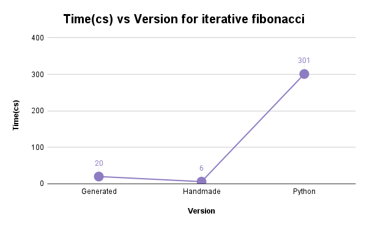
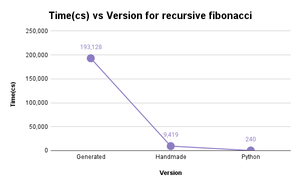
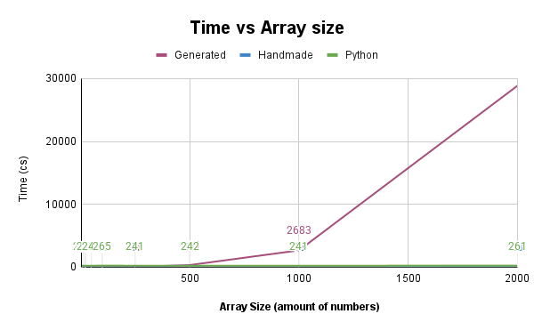

# python-c-compiler

# Students: Felipe Bianchini, C21178. André Salas, C27058

The current version of the project consists of a lexer and a parser that takes in a simplified form of Python called Fangless Python and outputs a series of tokens and errors, which are sent to the parser to check for syntax errors.

## User Guide

To run the lexer you need a text file, it should be written in Fangless Python, but the lexer is able to analyze any text and return the errors found. The tests folder contains examples of code for analyzing.

To choose a text file to analyze, you need to edit tester_lexer.py, changing the file path in line 5 of the file. After choosing a file to check, run the lexer using the following command:

    python tester_lexer.py

The terminal will show the tokens found, showing: Type, value and line. After the tokens are shown the errors will follow, it will also print their value and line and column alongside the actual line it happens.

To run the parser you need the exact same type of file to analyze. Edit tester_parser.py to open your desired file and use the following command:

    python tester_parser.py

The terminal will show a list of all the productions found, and, if a correct file was given, a final list of all the productions. It should be noted that the parser prints all errors as it finds them, not at the end. Furthermore, when running the parser the files parser.out and parsetab.py are created inside the src/ folder, these describe the internal functioning and decision making of the parser.

## Components

### Lexer

The Lexer is in the file src/lexer.py. It contains a Regex description for the tokens that can be found in the text, these tokens are saved in the "tokens" array. The Regex for each token is declared as t_<TokenName\>. 

The lexer also contains the methods handle_dedentation, which checks for dedentation on lines that do not start on a whitespace, checking against the last line and creating as many DENT tokens as needed. On the case of lines that start in whitespace, the method handle_indentation can create both INDENT and DENT values as needed.

Since PLY doesnt allow t_<TokenName\> methods to return more than one token, a stack was created that allows for the indentation-handling methods to input many tokens in a single method. The "token" method takes into account this stack and return from it when asked for a token unless it is empty.

### Parser

The Parser is located in the file src/parser.py. It contains productions for the many different valid token combinations allowed in fangless Python.

The productions are divided in different types, including loops, conditionals, assignments, etc. The final objective of the parser is to reach the "program" productions which describes a full and correct fangless python source code.

### Code generator

Generates code based on the parse tree created by the parser.

#### Symbol table

Used by the Visitor class to save variables, their scope, value and type. It helps the Visitor to easily control the existing variables and check their data.

#### Visitor

Receives the parser tree and an empty Symbol table, it generates a plain text string containing all the needed code to run, it should be noted that utilities.hpp is needed to compile the finished code.

#### Utilities.hpp

Contains extra code needed to facilitate the handling of certain contexts. More specifically, it allows for std::cout to print std::any and other types of variables, facilitating their use.

#### Testing

For the sake of testing the code generator, a file named tester_semantic.py exists. It call the lexer, parser and visitor in line and creates a new .cpp with the same name as the input .py file where it writes the final resulta of the code generator.

### Algorithm comparison

#### Iterative Fibonacci

| Version   |   Time(cs) |
|-----------|----:|
| Generated |  20 |
| Handmade  |   6 |
| Python    | 301 |

The results of this test are exactly as expected: C++ should, in theory, be faster than Python, even when taking into account the constant variable converting that happens in the generated version of the code.

#### Recursive Fibonacci

| Version   |   Time(cs) |
|-----------|----:|
| Generated |  193,128 |
| Handmade  |   9,419 |
| Python    | 240 |

The recursive fibonacci test shows unexpected results. The generated version's result can be explained by all the needed conversion, which creates a bigger overhead as more and more recursive calls are made. On the case of the handmade C++ being worse than Python, it can only be explained by differences in the habdling of recursive calls between languages, since both algorithms are almost identical.

#### Bubble sort 

For this table, the numbers on the top denote the amount of numbers in the array, the 3 lower rows denote the amount of cs taken to run the sorting algorithm.

| Version   |   5 |  10 |  20 |  25 |  50 | 100 | 250 | 500 | 1000 |  2000 |
|-----------|----:|----:|----:|----:|----:|----:|----:|----:|-----:|------:|
| Generated |  11 |   2 |   9 |   9 |   9 |  11 |  51 | 345 | 2683 | 28858 |
| Handmade  |   9 |   1 |   9 |   8 |   9 |   8 |   7 |  11 |   13 |    23 |
| Python    | 242 | 241 | 239 | 241 | 240 | 265 | 241 | 242 |  241 |   261 |

As can be seen in the graph and table, the version generated by our code generator becomes extremely slow as the array size grows, while the other versions are less affected by the size of the array. On the subject of the other 2 versions, C++ beats Python in all the tests, as was expected considering their differences in terms of speed.